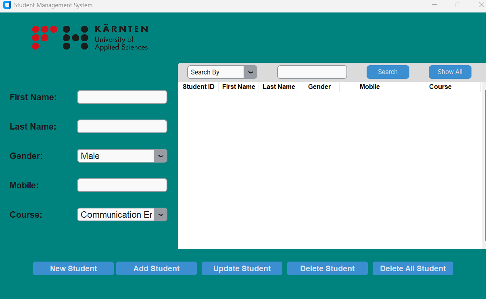

  

# 🎓 Student Management System

**CRUD-based Desktop App** — Manage student information easily with GUI and MySQL database integration.

## 💡 Introduction
This project is built as part of my Software Development final project. 
It allows creating, reading, updating, and deleting student records 
using a Tkinter GUI and MySQL backend.

## 🧩 Tech Stack
- Python
- Tkinter
- MySQL
- MySQL Connector

## ⚙️ Features
- Add, view, update, delete students
- Search by name or ID
- Persistent storage in MySQL

